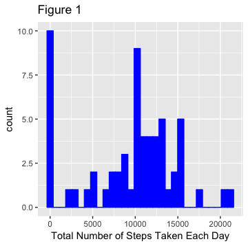
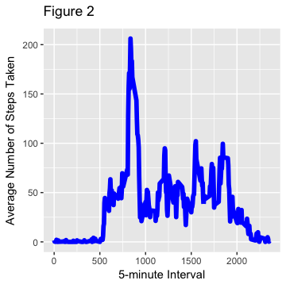
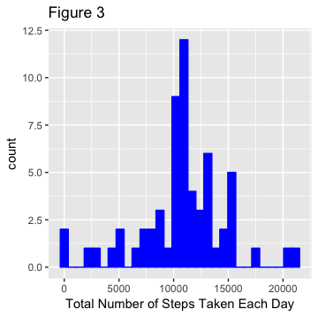
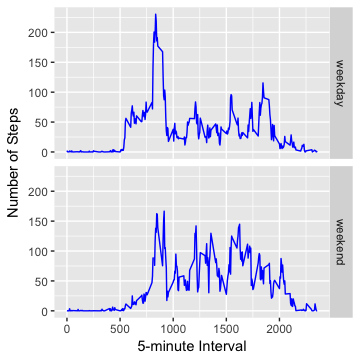

```{r setup, include=FALSE}
knitr::opts_chunk$set(echo = TRUE)
```

### Loading and preprocessing the data
```{r dat, echo = TRUE}
#Load required libraries
library(data.table)
library(ggplot2)
#Load csv data
dat <- data.table(read.csv("~/Downloads/activity.csv"))
```

### What is mean total number of steps taken per day?
```{r totalSteps, echo = TRUE}
#Ignore missing values in the dataset, use tapply on "steps" and sort by date. 
totalSteps <- tapply(dat$steps, dat$date, FUN = sum, na.rm = TRUE)
#Plot histogram and qplot
qplot(totalSteps, binwidth=3, xlab = "Total Number of Steps Taken Each Day", main = "Figure 1") + 
  geom_histogram(colour = "blue", fill= "blue")
mean(totalSteps, na.rm = TRUE)
median(totalSteps, na.rm = TRUE)
```
 

1. Average number of steps per day = ***9354.23***.
2. Median number of steps per day = ***10,395***


### What is the average daily activity pattern?
```{r averageSteps, echo = TRUE}
#Time series plot of 5-minute interval and average steps taken, on average across all days (y-axis)
averageSteps <- aggregate(x = list(steps = dat$steps), by = list(interval = dat$interval), FUN = mean, na.rm = TRUE)
ggplot(data = averageSteps, aes(x = interval, y = steps)) +
  geom_line(color = "blue", lwd = 2) + 
  xlab("5-minute Interval") + 
  ylab("Average Number of Steps Taken") + 
  labs(title = expression("Figure 2"))
```
```{r averageSteps, echo = TRUE}
#What is the maximum number of steps of 5-minute interval, averaged across all days?
averageSteps[which.max(averageSteps$steps),]
```
 

The 5-minute interval that contains the maximum averaged number of steps is 8:35 am (***835***).  
The maximum averaged number of steps is ***206.1698***


### Imputing missing values

Note that there are a number of days/intervals where there are missing values (coded as `NA`).
The presence of missing days may introduce bias into some calculations or summaries of the data.
```{r missing, echo = TRUE}
#Replace missing values with "NA"
missing <- is.na(dat$steps)
#Total missing values
table(missing)
```
There are **2,304** missing values in the dataset.

All of the missing values are filled in with mean value for that 5-minute interval.
```{r fill.value, echo = TRUE}
#Replace each missing value with the mean value of its 5-minute interval
fillValue <- function(steps, interval) {
  filled <- NA
  if (!is.na(steps))
    filled <- c(steps)
  else
    filled <- (averageSteps[averageSteps$interval == interval, "steps"])
  return(filled)
}
filledData <- dat
filledData$steps <- mapply(fillValue, filledData$steps, filledData$interval)
#Verify again any missing dataset
missing <- is.na(filledData$steps)
table(missing)
```

Using the filled data set, create a histogram of the total number of steps taken each day and calculate the mean and median total number of steps.
```{r totalSteps, echo = TRUE}
#Plot histogram of total number of steps taken each day
totalSteps <- tapply(filledData$steps, filledData$date, FUN = sum)
qplot(totalSteps, binwidth = 3, xlab = "Total Number of Steps Taken Each Day", main="Figure 3") + 
  geom_histogram(colour = "blue", fill = "blue")
#Calculate mean and median total number of steps
mean(totalSteps)
median(totalSteps)
```
 

1. Average (mean) number of steps per day is **10766.19**.
2. The median number of steps per day is **10766.19**.
3. From the new filled dataset, the mean and median values are higher as compared to the original dataset. 
4. In the original dataset, there are days with `steps` values `NA` for any `interval`. 
5. The total number of steps taken in such days are set to 0s by default. 
6. After replacing missing `steps` values with the mean `steps` of associated `interval` value, these 0 values are removed from the histogram of total number of steps taken each day.

#### Are there differences in activity patterns between weekdays and weekends?
First, find the day of the week for each measurement in the dataset. For
this part, we will use the dataset with the filled-in values.
```{r}
weekdayORweekend <- function(date) {
    day <- weekdays(date)
    if (day %in% c("Monday", "Tuesday", "Wednesday", "Thursday", "Friday")) 
        return("weekday") else if (day %in% c("Saturday", "Sunday")) 
        return("weekend") else stop("invalid date")
}
filledData$date <- as.Date(filledData$date)
filledData$day <- sapply(filledData$date, FUN = weekdayORweekend)
```

Now, let's plot the average number of steps taken on both weekdays and weekends.

```{r}
averages <- aggregate(steps ~ interval + day, data = filledData, mean)
ggplot(averages, aes(interval, steps)) + 
    geom_line(color = "blue") + 
    facet_grid(day ~ .) + 
    xlab("5-minute Interval") + 
    ylab("Number of Steps")
```
 


1. From the plots, we can see that there is some differences between the weekdays and weekends.
2. It appears that on weekdays, there is more activity in the morning but lesser as the day progresses.
3. Meanwhile, during the weekends, there is more consistent activity throught out the day. 


